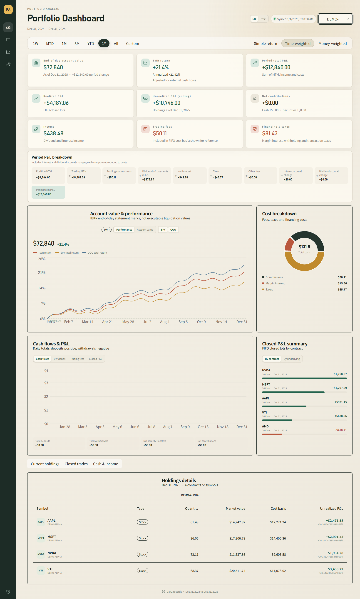

# Portfolio Analyze

**English** | [简体中文](README.zh-CN.md)

A local portfolio dashboard for Interactive Brokers Flex statements, built with
React, Wealthfolio UI, Recharts and a Python/SQLite backend. Available in English
and Simplified Chinese. Account data stays on the machine running the application.



*Illustrative preview generated entirely from synthetic data. No real accounts,
holdings, transactions or investment results are shown.*

## Features

- English / 简体中文 switch with a saved language preference.
- Account and custom date filters, plus 1W, MTD, 1M, 3M, YTD, 1Y and ALL ranges.
- Daily net asset value, TWR, Modified Dietz returns and annualized returns.
- SPY and QQQ benchmark comparison on a shared percentage axis.
- Position details, FIFO closed-lot profit, dividends and cash movements.
- Per-symbol filters and period totals for dividends and closed-trade profit.
- Local SQLite storage with command-line imports and synchronization.

## Try the Preview

Requires Python 3.10+ and Node.js 22.12+. No IBKR credentials are needed.

```powershell
npm ci
npm run build
python scripts/demo_preview.py
```

Open `http://127.0.0.1:4180`. The preview serves the same application with
deterministic synthetic data and does not access account databases or external
services. Stop it with Ctrl+C. Use the header language control to switch languages.

## Run on Windows

Requires Python 3.10+ and Node.js 22.12+.

1. Install dependencies with `npm ci`.
2. Copy `scripts/.env.example` to `scripts/.env`. Configure your own Flex Web
   Service token and Activity Flex Query ID. Use one query containing all accounts
   you want to monitor, XML output, and daily breakout.
3. Import or synchronize your account data:

   ```powershell
   python scripts/ibkr_analyzer.py doctor
   python scripts/ibkr_analyzer.py sync-history --days 365 --chunk-days 29
   ```

4. Download benchmark prices with `sync-benchmarks.bat`.
5. Double-click `start.bat`. The dashboard opens at `http://127.0.0.1:4173`.

For explicit historical ranges, run:

```powershell
python scripts/ibkr_analyzer.py sync --from 2024-01-01 --to 2024-12-31 --chunk-days 29
```

For archived XML statements:

```powershell
python scripts/ibkr_analyzer.py import-xml --help
```

The dashboard expects these Flex sections: Account Information, Cash Report,
Cash Transactions, Open Positions, Trades with Closed Lots, Financial Instrument
Information, Transfers, Commission Details, Transaction Fees/Taxes, Net Asset
Value in Base, and Mark-to-Market Performance Summary in Base. Include currency
rates and daily breakout. Some sections are empty when there is no activity.

## Calculation Notes

The return card shows annualized performance alongside XIRR, an annual
money-weighted return using dated net contributions and opening/closing values
with an Actual/365 day count. The opening value already includes flows on its
valuation date. Same-day periods and unresolved rates display a dash.

Statement valuations are the broker's daily marks and may differ from executable
liquidation prices. Closed-trade profit uses Flex FIFO values. Benchmarks use Yahoo
Finance adjusted close; the chart endpoint is an unofficial service and may change.

## CLI and Scheduling

```powershell
python scripts/ibkr_analyzer.py --help
python scripts/daily_sync.py
python backend/benchmarks.py sync
python backend/benchmarks.py status
python launcher.py --no-browser
npm run build
```

`daily_sync.py` synchronizes a trailing eight-calendar-day window ending on the
previous weekday and skips covered dates. After a longer interruption, use an
explicit `sync --from ... --to ...` range to fill older gaps. Windows Task
Scheduler can invoke these commands at a preferred time; cloning the repository
does not install system tasks.

## Local Configuration and Data

- Flex statements: `%APPDATA%/ibkr-analyzer/records.sqlite3` and its `raw` folder.
- Benchmark prices: `%APPDATA%/portfolio-analyze/benchmarks.sqlite3`.
- `IBKR_ANALYZER_ENV`: optional path to a Flex configuration file, honored by
  the importer and dashboard. `start.bat` selects `scripts/.env` when present.
- `IBKR_ANALYZER_HOME`: importer data directory override.
- `IBKR_ANALYZER_DB`: dashboard database path override.
- `PORTFOLIO_BENCHMARK_DB`: dashboard benchmark database path override; use
  `python backend/benchmarks.py --database PATH sync` for the matching download.

The dashboard's default configuration path also supports the local
`~/.codex/skills/ibkr-analyzer/scripts/.env` installation. No AI agent is required
when using the bundled scripts and `scripts/.env` configuration.

Credentials, statements, databases, logs, screenshots and personal analyses are
excluded from version control. No account data or populated configuration is
distributed. Services bind to localhost by default; do not expose account data
through a public deployment without authentication.

## License

MIT. See [LICENSE](LICENSE) and [third-party notices](THIRD_PARTY_NOTICES.md).
